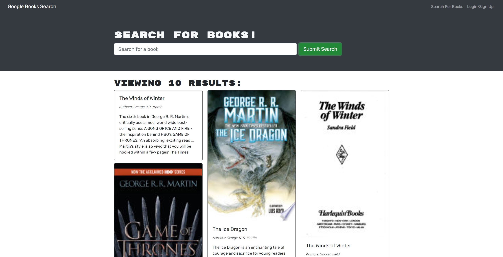

# Book Quickie

## Table of Contents  
* [Description](##Description)  
* [Technologies](##Technologies)  
* [Screenshot](##Screenshot)  
* [Installation](##Installation)  
* [License](##License)  
* [Questions](##Questions)  

## Description

Welcome to BookQuickie! This application will allow you search up any book (results courtesy of google books api), and add it to your wishlist. Wishlists are saved under accounts, so make an account and save some books!

### Technologies

My major contribution to this project was converting it from RESTful API architecture to GraphQL Query/Mutation architecture. Being my first full-stack MERN application, I've finally been able to explore the full stack with React interacting with GraphQL. Here are the major technologies used:
* React
* JSX
* GraphQL
* Apollo
* React-Router-Dom

### Future Development

This application will eventually have a feed showing top 5 wishlisted books, and user's ability to share their own books.

## Deployed Application

https://bookquickie.herokuapp.com/

## Screenshot

### Homepage

---

## Installation

N/A visit deployed page to view site. 

## License

No license

---

## Questions

If you have any follow up questions, feel free to reach out at toacinp@gmail.com  
GitHub: https://www.github.com/Toacin
